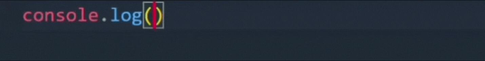

# Hi, I'm Yesmer Castrillo 👋
I am a young programming lover who wants to contribute to the community and society, with technologies that can help facilitate exhaustive and repetitive tasks of our daily lives.

I really like web development and I keep learning new things constantly to improve every day as a programmer, so my expectations are to build my learning

## Right now I'm getting rid of myself in:
* constantly learning
* creating personal projects to develop my experience
* studying systems engineering for a degree
* improving my english skills

## My skills

- 👀 I’m interested in ...
- 🌱 I’m currently learning ...
- 💞️ I’m looking to collaborate on ...
- 📫 How to reach me ...
<!---
yesmer28/yesmer28 is a ✨ special ✨ repository because its `README.md` (this file) appears on your GitHub profile.
You can click the Preview link to take a look at your changes.
--->
